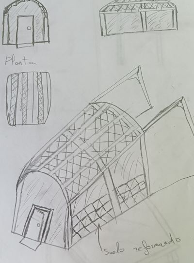

# Tecnología 25-26 Adrían Carrillo Berrio 
Invernadero: El estado del invernadero era desgastado con su plastico muy facil de romper y estructuras dañadas como el suelo por ejemplo mostrare
una imágenes de su estado actual:

  

# Boceto:
Esta en un estado como repito dañando cual se debe de reformar claramente, por eso diseñe este boceto de como YO lo reformaria como un plastico nuevo, un suelo más equilivadro y nuevos apoyos para hacer la estructura más estable para que resulte en como aparte que sea más estable y esteticamente mejor:

se debe de confimar los materiales y también se debe organizar el grupo y en que boceto nos basaremos para tener un resultado final.

#Mapa:
El mapa es otro proyecto cual recuperamos un mapa de Jáen para mostrarlo al publico y exponer un trabajo del anterior año construyendo su estructura y diseñando su modelos:

 

#Boceto:
La clase mostrata sus propios modelos de como haremos la estructura para ponerlo en común escogerlo, asi poder mostrarlo publicamente con una estructura simple, barata y estable:

 
