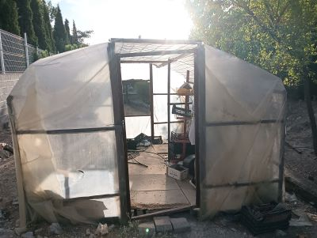
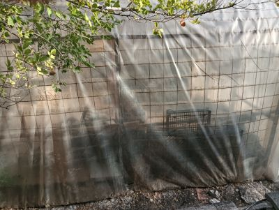
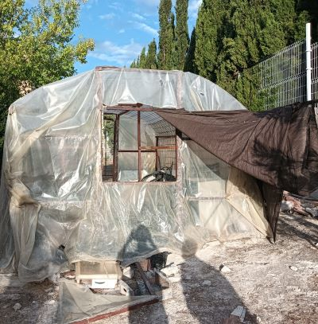
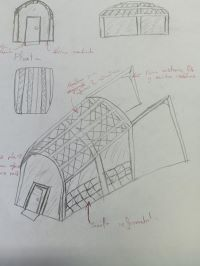
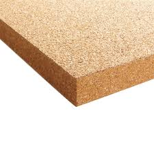
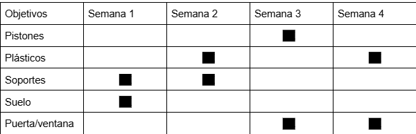
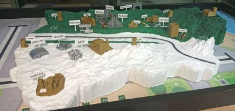
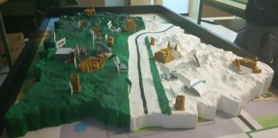
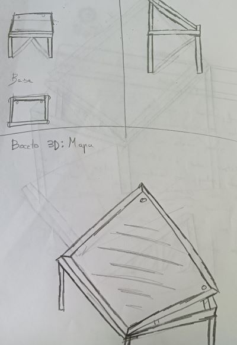
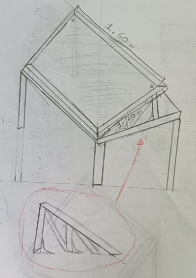

# Tecnología 25-26 Adrían Carrillo Berrio 
# Invernadero:
El estado del invernadero es deteriorado, con el plástico muy fácil de romper, el suelo esta dañado, puerta y ventana en estado deteriorado, pistones rotos y estructuras dañadas en resumen. A continuación, mostraré algunas imágenes de su estado actual:

  

## Boceto:
Está en un estado, como repito, dañado, por lo cual claramente necesita ser reformado. Por eso diseñé este boceto de cómo yo lo reformaría: con un plástico nuevo, un suelo más nivelado y nuevos apoyos que refuercen la estructura, haciéndola no solo más estable, sino también estéticamente mejor:

Se deben confirmar los materiales y también organizar el grupo, además de definir en qué boceto nos basaremos para lograr un resultado final.

## Diseño 3D invernadero:

Aqui el diseño 3D del invernadero:

## Lista de materiales del invernadero

1. Madera: reciclada para los pilares
2. Soportes: reciclada para mantener los pilares
3. Plastico de invernadero: 2 x 6 m 14,84 €
4. Paquete de 1000 Tornillos tirafondo 5,0 X 16 mm para Madera 31,63 € (1 tornillos tiranfondo valor = 0,03)
5.  Corcho para suelo del invernadero: 300mm x 300mm x 4 mm paquete de 9 = 22,79€

## Planificación del invernadero:

# Mapa:
El mapa es otro proyecto en el que recuperamos un mapa de Jaén para mostrarlo al público y exponer un trabajo del año anterior, construyendo su estructura y diseñando sus modelos:

 

## Boceto:
La clase mostrará sus propios modelos de cómo haremos la estructura, para ponerlos en común y escoger uno. Así podremos presentarlo públicamente con una estructura simple, económica y estable.

Yo propongo que tenga una estructura de apoyo más triangular y reforzada, y unas tablas que también refuercen ese mismo apoyo, para que quede estéticamente más bonito y asegurado, de modo que nadie intente quitar dicho apoyo.

 

## Diseño 3D mapa:
Aquí diseñé en 3D cómo quiero que sea la mesa del mapa y cómo me gustaría su diseño:

## Lista de materiales del mapa

1. Madera:cual se usara reciclada del instituto para crear la base
2. Soportes: también reciclada del instituto para sostener la madera
3. Metacrilato: 17€ el folio A4 por tamaño
4. Paquete de 1000 Tornillos tirafondo 5,0 X 16 mm para Madera 31,63 € (1 tornillos tiranfondo valor = 0,03)

## Planificación del mapa:

"Este texto fue corregido por la aplicación ChatGPT"
