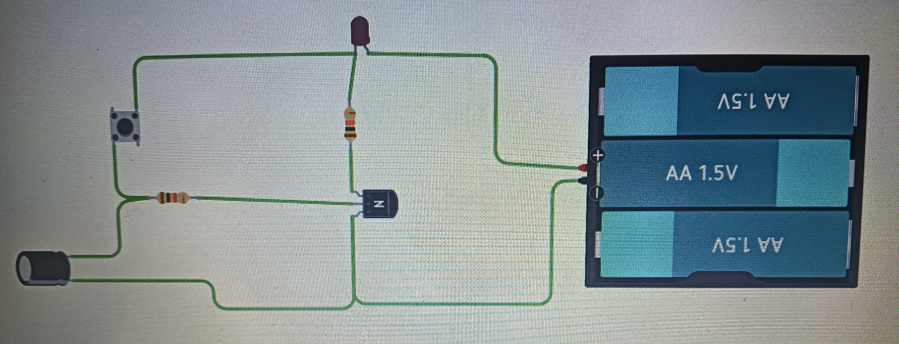

# Electrónica básica

## resistencias de valor fijo
- La funcion de la resistencia es dificultar el paso de corriente consiguiendo variaciones de tensión en los puntos del circuito donde sean necesario.

- Una resistencia sirve para limitar la corriente eléctrica, proteger componentes electrónicos y dividir voltajes e.c.t.
  
- Lo usamos para que otros componentes del circuito no se dañene por el exceso de voltaje para ellos por la pila.

- Su simbolo electrónico es :
  
  
  

- Se mide por el codigo de colores:
  
  

- Asi se ve una resistencia de valor fijo:

## Resistencias de valor variable o potenciómetros

- Las resistencias variables o potenciómetros dispone de tres contactos y tienen un valor total máximo entre sus extremos, el valor entre los extremos y el central puede variarse mediante el giro de una pieza.

- Las resistencias de valor variable o potenciómetros los usamos como por ejemplo para cambiar el volumen de los altavoces, es resumén para que la intendidad de la resistencia varie depediendo a nuestro uso y como lo queramos.

- la diferencia entre uno fijo es que podemos adaptarlo a nuestra comodidad o por su etorno algunas resistencias de valor variable puede cambiar a por luz, humedad e.t.c que cambie en su etorno.

- Su simbolo electrónico es:

  

- Así se ve una resistencia de valor variable o potenciómetro:

  

 ## Condensadores
  
- Un condensador es un dispositivo que acumula energia para cuando el circuito no tenga carga use esa carga que acumulo para que el circuito duro unos momentos aunque es casi excasa

- Se usan como en las luces de un coche cuando nos fijamos que se apaga lentamente es gracia al condensador y asi se evitar cortar de un corte el circuito.

- Dependiendo de su tamaño la energia que acumule durara más o menos y los mejores tiene hasta un liquido dentro que aumenta su eficiencia y se pueden clasificar en no polarizados y polarizados.

- Su simbolo electrónico es:

  

- Así se ve unos condensadores:

  

## Diodos

- Los diodos hace que los electrones pasen po un sentido gracias al material semiconductor cual esta compuesto el comportamiento que provoca permite dirigir la corriente eléctrica protegiendo otros componentes en el circuito.

- Su uso es cambiar la orentación de electrones a un sentido para proteger componentes como antes puse.

- ..

- Su simbolo electrónico es:

  

- Así se ve un diodo:

  

## Diodos LEDS

- Los diodos LED es un tipo especial de diodo que es capaz de emitir luz atravesando la corriente eléctrica debido a su bajo consumo u facíl fabricación se emplea.

- Sirven para iluminar

- Se miden con la tabla de tesión umbral:
  

- Su simbolo tecnologico es:

- Asi se ven un diodo LED:

## Los transistores

- ¿Para que sirve?:Los transistores es un elemento principal de los cricuitos electronicos cual posee tres patillas denominadas base, colector y emisor y funciona como un interruptor automático.

- Funcionamiento interno: Funciona como un interruptor automático que se activa con una pequeña corriente en la base que permite la conexion con el colector y el emisor.

- Símbolo eléctrico:
  
  
  
- Imagen real:

## Relés

- ¿Para que sirve?: Los relés funcionan como un tipo de controlada por electricidad  cual pasa por una bobina.

- Funcionamiento interno: Una bobina es un componente con dos terminales que alamecan la energía en un campo magnético cual atare armadura móvil y al moverse cambia de posición cerrando y abriendo.

Simbolo eléctronico:

  

imagen real:

## CIRCUITOS:

- 1 
  
- 2 

- 3 

